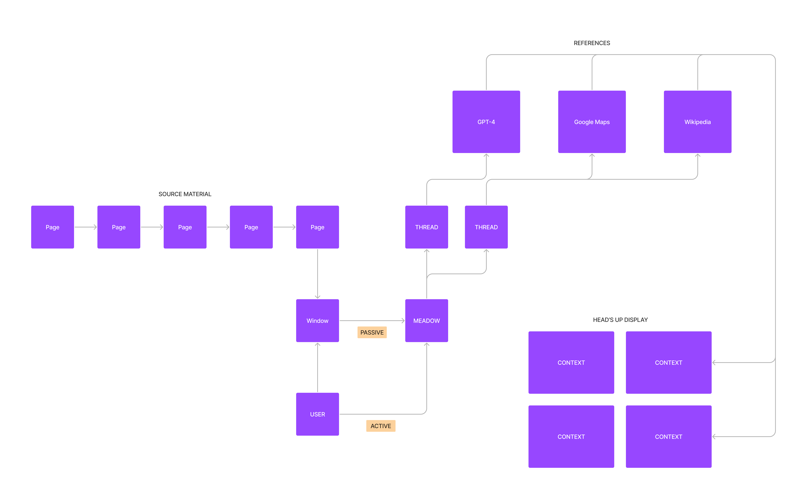

> I like to think (and
> the sooner the better!)
> of a cybernetic meadow
> where mammals and computers
> live together in mutually
> programming harmony
> like pure water
> touching clear sky. 

\- [Richard Brautigan](https://allpoetry.com/All-Watched-Over-By-Machines-Of-Loving-Grace)

## Meadow

Meadow is a personal AI copilot for deep work. The very first version is a _head's up display for active reading_. Think [JARVIS](https://en.wikipedia.org/wiki/J.A.R.V.I.S.) but studying and reflecting.

## The first use case

The first use case is as a thread-following assistant for when I'm sitting at my desk reading. As I read I encounter a million little threads I could follow. Some of these threads I note with a physical mark in the book. Some of the threads are urgent enough that I follow them immediately. Most of the time, following a thread has a high cost, the cost of falling out of or failing to enter a flowstate.

Some threads are never followed. In fact, if I really pay attention I notice that the _vast majority of threads are never followed_. As we read we maintain a mental "image" of whatever we're reading. The fidelity and resolution of that image are both imperfect. Every tiny discrepancy between the source text and our mental image could be considered a thread. One example which is salient to my life right now is geographical context. Imagine if all the relevant maps were always just a glance away regardless of the book you were reading. Imagine if for every dialogue there was a _dramatis personae_ just a hotkey away. More generally:

_What if we had a system that reads along with us, notices all the little threads, and anticipates what additional context we might want?  What if that system could also research and/or generate the context we need? If we never had to follow these threads ourselves, how much deeper could we sink into our learning environment?_

## A broader vision

Ultimately I want to be able to do serious, productive thinking without sitting at my desk. I want to be able to go for a hike and write a technical proposal for a new software system, I want to be able to decode some opaque scholastic apologia while riding a bike, I want to be able to learn to speak Arabic while walking down the beach, etc.

Further down the road, I want Meadow to go with me everywhere. But I specifically want Meadow to follow me around at home. Today we have "Alexa, is it going to rain today?" but I want "Meadow, how much will it cost to fix this sprinkler?" or "Meadow, where did I put the multi-tool?". I want Meadow to help keep me in a flow state, to help manage the inifinite threads of _life_ rather than just the ones I find in books.

## Meadow v0.0.1

We're building a _Head's Up Display for Active Reading_. Here's the logical architecture:

The first version is basic. In words it's as follows:

- The user has a _window_ into some _source material_. The window represents the specific part of the source material which is most likely to be active right now inside the user's head.
- The window is fed as input into Meadow. The window could be physically any number of things. It could be an open PDF, or a web browser, or a video feed of an open book, etc.

- In _passive_ mode, Meadow parses the feed for likely open _threads_. A thread is a path leading away from the source material which the user may want to follow. 
- In _active mode_, Meadow additionally parses some kind of user input. Each user input indicates to Meadow which specific thread to follow. For example, if the user highlights a paragraph and draws a "?" next to it, Meadow can assume that the user doesn't understand the meaning of the paragraph.
- Meadow follows the thread through various reference tools and generates _contexts_ which the user may find interesting.
- Meadow outputs these context's into the _head's up display_. The head's up display could be physically a browser window, or a text log, or audio out, etc.

For Meadow v0.0.1 we need to make some decisions about which specific implementation we should use for each of the above components. A first pass at the decisions:

- The quickest version for source material could be an ordered list of markdown files. The window could be a single file. I think I'm going to jump over this step and go straight to a video feed of an open book. It's not strictly the best decision from an operational POV, but I want to do it because
  1. I personally want to use Meadow when I read phyiscal books,
  2. Multimodal AI is kinda hot right now so there's a lot of activity to draw on, and
  3. It just seems way cooler for Meadow to "see".
- Passive mode only.
- I'm reading through a 4000-page history of philosophy, so the threads I want are:
  - a bio of each historical figure
  - a map of each geographical location
  - a translation of all non-English text
- I've been using GPT-4 "manually" via ChatGPT as I've been reading recently, and it does a remarkable job of answering my questions, so I'm just going to worry about GPT-4 as a reference for now.
- The head's up display will just be a text file that I can `tail -f`.